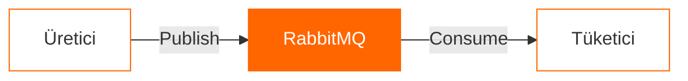
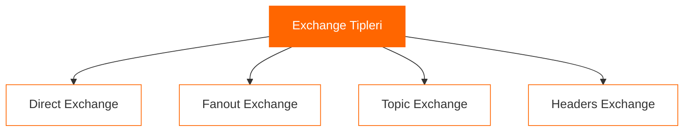
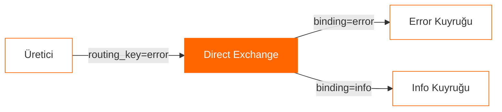
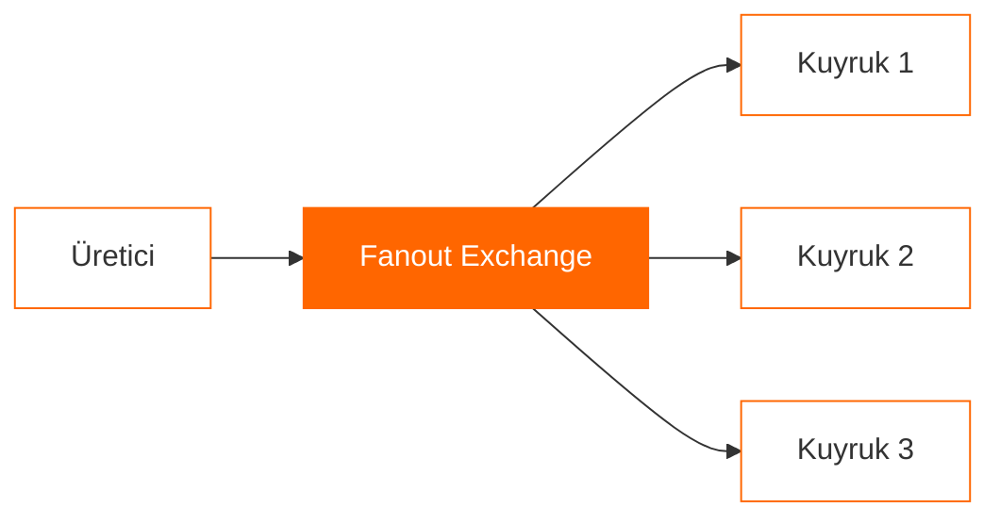
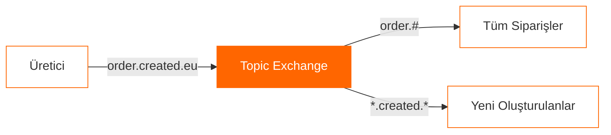
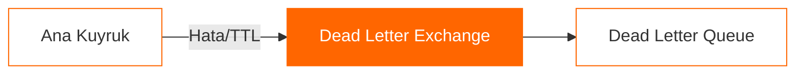

# RabbitMQ Diyagramları

## 1. Genel Mimari

```mermaid
graph LR
    style Producer fill:#fff,stroke:#FF6600
    style RabbitMQ fill:#FF6600,stroke:#FF6600,color:white
    style Consumer fill:#fff,stroke:#FF6600
    
    Producer[Üretici] -->|Publish| RabbitMQ[RabbitMQ]
    RabbitMQ -->|Consume| Consumer[Tüketici]
```

## 2. Exchange Tipleri

```mermaid
graph TD
    style Exchange fill:#FF6600,stroke:#FF6600,color:white
    style Direct fill:#fff,stroke:#FF6600
    style Fanout fill:#fff,stroke:#FF6600
    style Topic fill:#fff,stroke:#FF6600
    style Headers fill:#fff,stroke:#FF6600

    Exchange[Exchange Tipleri] --> Direct[Direct Exchange]
    Exchange --> Fanout[Fanout Exchange]
    Exchange --> Topic[Topic Exchange]
    Exchange --> Headers[Headers Exchange]
```

## 3. Direct Exchange Örneği

```mermaid
graph LR
    style Producer fill:#fff,stroke:#FF6600
    style Exchange fill:#FF6600,stroke:#FF6600,color:white
    style Q1 fill:#fff,stroke:#FF6600
    style Q2 fill:#fff,stroke:#FF6600

    Producer[Üretici] -->|routing_key=error| Exchange[Direct Exchange]
    Exchange -->|binding=error| Q1[Error Kuyruğu]
    Exchange -->|binding=info| Q2[Info Kuyruğu]
```

## 4. Fanout Exchange Örneği

```mermaid
graph LR
    style Producer fill:#fff,stroke:#FF6600
    style Exchange fill:#FF6600,stroke:#FF6600,color:white
    style Q1 fill:#fff,stroke:#FF6600
    style Q2 fill:#fff,stroke:#FF6600
    style Q3 fill:#fff,stroke:#FF6600

    Producer[Üretici] --> Exchange[Fanout Exchange]
    Exchange --> Q1[Kuyruk 1]
    Exchange --> Q2[Kuyruk 2]
    Exchange --> Q3[Kuyruk 3]
```

## 5. Topic Exchange Örneği

```mermaid
graph LR
    style Producer fill:#fff,stroke:#FF6600
    style Exchange fill:#FF6600,stroke:#FF6600,color:white
    style Q1 fill:#fff,stroke:#FF6600
    style Q2 fill:#fff,stroke:#FF6600

    Producer[Üretici] -->|order.created.eu| Exchange[Topic Exchange]
    Exchange -->|order.#| Q1[Tüm Siparişler]
    Exchange -->|*.created.*| Q2[Yeni Oluşturulanlar]
```

## 6. Dead Letter Exchange

```mermaid
graph LR
    style MainQ fill:#fff,stroke:#FF6600
    style DLX fill:#FF6600,stroke:#FF6600,color:white
    style DLQ fill:#fff,stroke:#FF6600

    MainQ[Ana Kuyruk] -->|Hata/TTL| DLX[Dead Letter Exchange]
    DLX --> DLQ[Dead Letter Queue]
```