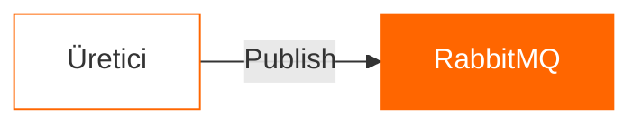
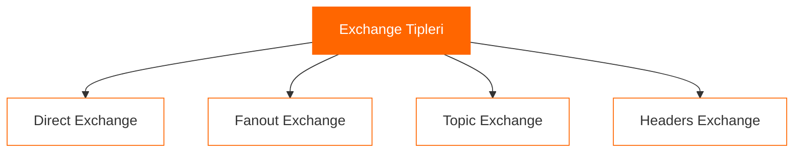
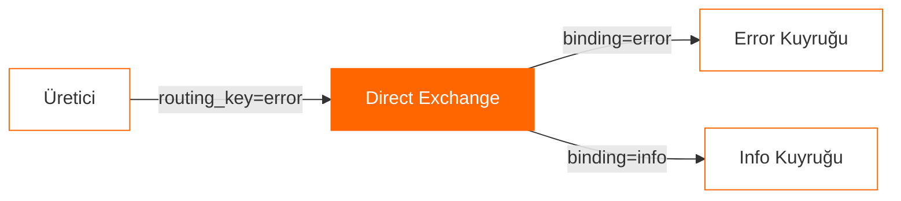
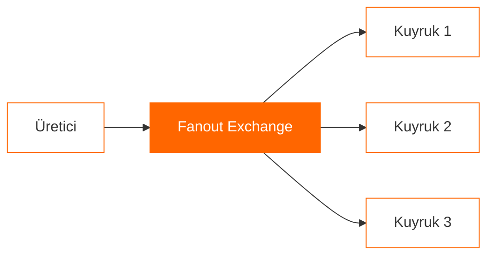
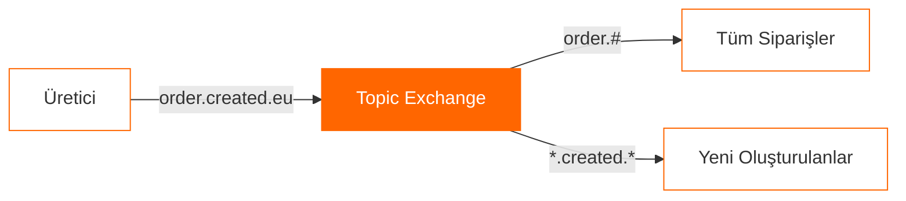
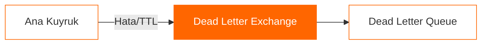

# RabbitMQ Mimari Standartları: Kapsamlı Bir Rehber


## Giriş
Modern yazılım dünyasında dağıtık sistemler ve mikroservis mimarileri giderek yaygınlaşıyor. Bu sistemlerin en önemli bileşenlerinden biri olan mesaj kuyruk sistemleri, uygulamalarımızın güvenilir ve ölçeklenebilir olmasını sağlıyor. RabbitMQ, bu alanda en çok tercih edilen çözümlerden biri.

## RabbitMQ Nedir?
RabbitMQ, açık kaynaklı bir mesaj broker'ıdır. AMQP (Advanced Message Queuing Protocol) protokolünü temel alır ve güvenilir, hızlı ve esnek bir mesajlaşma altyapısı sunar.

## Temel Kavramlar

### 1. Producer (Üretici)
- Mesajları üreten ve RabbitMQ'ya gönderen uygulamalar
- Mesajları doğrudan kuyruklara değil, exchange'lere gönderir
- Mesaj gönderirken routing key kullanır



### 2. Consumer (Tüketici)
- Kuyruktan mesajları işleyen uygulamalar
- Mesajları senkron veya asenkron işleyebilir
- Acknowledgment mekanizması ile mesaj işleme garantisi sağlar

### 3. Exchange Tipleri



#### a) Direct Exchange


#### b) Fanout Exchange


#### c) Topic Exchange


### 4. Dead Letter Exchange


## Best Practices

### 1. Mesaj Dayanıklılığı
- Önemli mesajlar için durable queue kullanın
- persistent=true ile mesajları disk'e yazın
- Publisher confirms kullanın

### 2. Performans Optimizasyonu
- Prefetch count ayarı
- Bulk mesaj işleme
- Connection pooling
- Channel yönetimi

### 3. Hata Yönetimi
- Dead Letter Exchange (DLX) kullanımı
- Retry mekanizması
- Circuit breaker pattern
- Monitoring ve alerting

## Örnek Kod

### Direct Exchange Örneği
```csharp
// Producer
channel.ExchangeDeclare("direct_logs", ExchangeType.Direct);
channel.BasicPublish(
    exchange: "direct_logs",
    routingKey: "error",
    body: Encoding.UTF8.GetBytes(message)
);

// Consumer
channel.ExchangeDeclare("direct_logs", ExchangeType.Direct);
channel.QueueBind(queueName, "direct_logs", "error");
```

### Topic Exchange Örneği
```csharp
// Producer
channel.ExchangeDeclare("topic_logs", ExchangeType.Topic);
channel.BasicPublish(
    exchange: "topic_logs",
    routingKey: "order.created.eu",
    body: Encoding.UTF8.GetBytes(message)
);

// Consumer
channel.ExchangeDeclare("topic_logs", ExchangeType.Topic);
channel.QueueBind(queueName, "topic_logs", "order.*.eu");
```

## Sonuç
RabbitMQ, doğru kullanıldığında sistemlerinize güvenilirlik, ölçeklenebilirlik ve esneklik kazandırır. Bu rehberde anlattığımız mimari standartlar ve best practice'ler, RabbitMQ tabanlı sistemlerinizi daha etkili bir şekilde tasarlamanıza yardımcı olacaktır.

#rabbitmq #messagequeue #microservices #software-architecture #dotnet